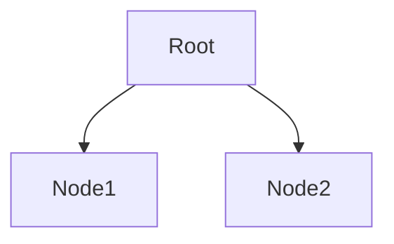

工具列表
===

[搜索引擎]()
---
- [Slides](https://slideplayer.com)
- [Books](https://zh.singlelogin.me/)
- [GitHub](https://github.com/)
- [KDE](https://invent.kde.org/explore/groups?sort=name_asc)
- [知网](https://www.cnki.net/)
- [IEEE Xplore](https://ieeexplore.ieee.org/Xplore/home.jsp)
- [SPIE.DigitalLibrary](https://www.spiedigitallibrary.org)
- [谷歌学术](scholar.google.com)

[视频编辑器](https://en.wikipedia.org/wiki/Category:Video_editing_software)
---
1. [NLE](https://en.wikipedia.org/wiki/Non-linear_editing)
- [Adobe Premiere](https://en.wikipedia.org/wiki/Adobe_Premiere_Pro)
- [Final Cut Pro](https://en.wikipedia.org/wiki/Final_Cut_Pro)
- [Blender](https://en.wikipedia.org/wiki/Blender_(software)) <*Free*> <*OpenSource*>

[视频分析工具]()
---
- [YUView](https://github.com/IENT/YUView)
- [YUV Viewer and Analysis Tool](http://ient.github.io/YUView/)
- [YUVToolkit]()
- [Video analysis StreamEye - Elecard](https://www.elecard.com/zh/products/video-analysis/streameye)
- 

[图形调试器]()
---
- [RenderDoc](https://renderdoc.org/)
```
RenderDoc is a free MIT licensed stand-alone graphics debugger that allows quick and easy single-frame capture and detailed introspection of any application using Vulkan, D3D11, OpenGL & OpenGL ES or D3D12 across Windows 7 - 10, Linux, Android, Stadia, or Nintendo Switch™.
```

[图像绘制器](https://en.wikipedia.org/wiki/Comparison_of_raster_graphics_editors)
---
- [Krita](https://en.wikipedia.org/wiki/Krita)  <*Free*> <*OpenSource*> |
  [Building Krita from Source](https://docs.krita.org/en/untranslatable_pages/building_krita.html#building-krita-from-source) |
  [Krita for Android](https://krita.org/en/item/krita-5-1-0-released/)
- [GIMP](https://en.wikipedia.org/wiki/GIMP) <*Free*> <*OpenSource*>
- [MyPaint](https://en.wikipedia.org/wiki/MyPaint)
- [Adobe Photoshop](https://en.wikipedia.org/wiki/Adobe_Photoshop)

[游戏引擎]()
---
- [Unity](https://unity.com/)
- [Unity手册](https://docs.unity3d.com/Manual/class-VideoPlayer.html)
- [Unreal](https://www.unrealengine.com/zh-CN)

[UX设计工具]()
---
- [Adobe XD](https://en.wikipedia.org/wiki/Adobe_XD)
- [Figma](https://en.wikipedia.org/wiki/Figma_(software))
- [Sketch](https://en.wikipedia.org/wiki/Sketch_(software))
- [Lunacy](https://icons8.com/lunacy) <*Free*>


